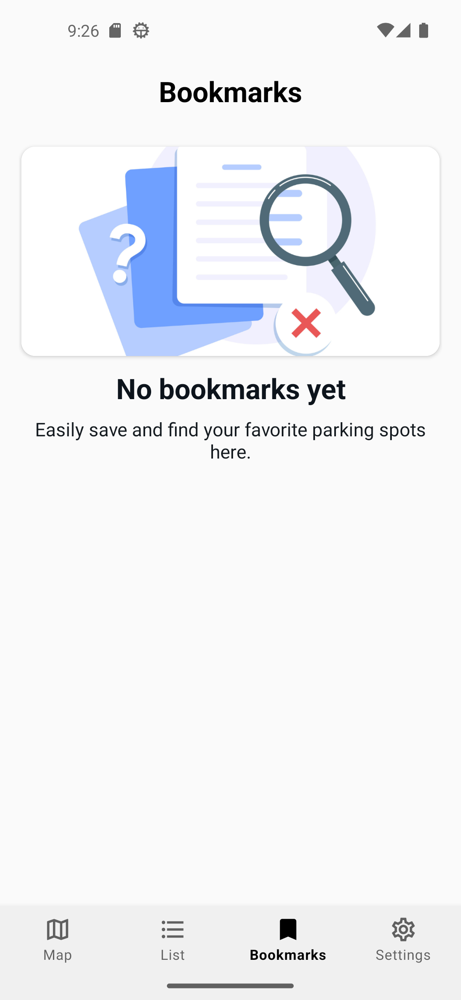
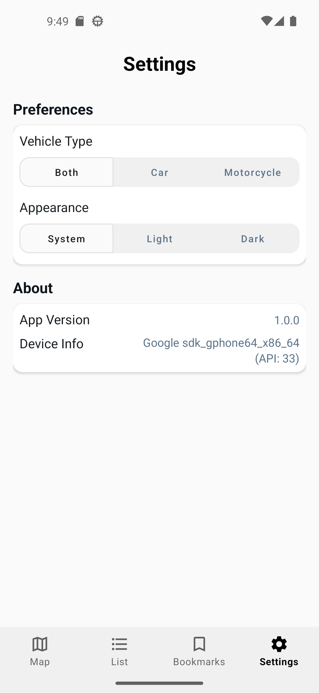

# ParkWhere - Find Car Parks Near You, Instantly
**ParkWhere** is an Android application that helps users find nearby car parks in Singapore, displaying real-time availability for both car and motorcycle parking lots. Designed for convenience and sustainability, it reduces the time and fuel spent searching for parking by providing live car park availability and location-based search.

## Features

### Adaptive Icon


- Adapts to the user's system theme and wallpaper, adjusting its color to seamlessly match the device's aesthetic changes colour
- The shape of the icon can also change across different device models

### Interactive Map
<a href="public/Interactive%20Map.mp4">
  
</a>

<em>Tap the image to see the Interactive Map in action.</em>

- Displays nearby car parks on Google Maps
- Circle centered on user's current location
- Adjustable search radius for parking lots
- Location search bar for place or address lookup
- Color-coded markers indicating availability 
	- 🟢 Equal or lesser than 70% full
	- 🟡 71 - 90% full
	- 🔴 More than 90% full

### Car Park List
<a href="public/Car%20Park%20List.mp4">
  
</a>

<em>Tap the image to see the Car Park List in action.</em>

- Lists nearby car parks sorted by nearest to furthest
- Quick access to live parking lot details and last updated timestamp
- Location search bar for place or address lookup

### Bookmarks
<a href="public/Bookmark.mp4">
  
</a>

<em>Tap the image to see the Bookmarks page in action.</em>

- Save frequently used car parks for easy future access

### Settings
<a href="public/Settings.mp4">
  
</a>

<em>Tap the image to see the Settings page in action.</em>

- Vehicle Type Filter: View parking lots for Car, Motorcycle or both (default)
- Application Appearance: Light, Dark or Sytem (default)

## Setup Instructions
### Requirements

- Android Studio
- Android SDK 33+
- Internet connection for real-time API calls
- Emulator or physical Android Device (Android 13.0+)

### Steps
1. **Clone the repository**
   ```bash
   git clone https://github.com/JianAn-S/ParkWhere.git
   cd ParkWhere
   ```

2. **Open in Android Studio**
   - Launch Android Studio
   - Select `Open an existing project`
   - Navigate to the cloned `ParkWhere` folder

3. **Generate and add your API key**
    - Visit [Google Cloud Console](https://cloud.google.com/)
    - Create a new project (or use an existing one)
    - Go to APIs & Services > Credentials and enable the required APIs:
    	- Maps SDK for Android
    	- Places API
    - Generate an API Key then create a file named `secret.properties` in the root directory and add:
    ```
    MAPS_API_KEY = YOUR_API_KEY_HERE
    ```

4. **Run the Application**
   - Plug in your device or start an emulator
   - Click ▶️ Run

## Tech Stack
- Language & Framework: Java (Android Studio)
- Architecture: MVVM (Model, View and ViewModel)
- Local Database: Room (SQLite) stores HDB Carpark Information
- UI & Design: Material Design component, XML layouts

## External APIs
- Google Maps SDK: Renders Google maps and car park markers
- Google Places API: Enables address and location search functionality
- [Data.gov.sg's CarPark Availability](https://data.gov.sg/datasets/d_ca933a644e55d34fe21f28b8052fac63/view): Provides real-time car park availability data
- [Data.gov.sg HDB Carpark Information](https://data.gov.sg/datasets/d_23f946fa557947f93a8043bbef41dd09/view): Supplies static information such as car park names and locations